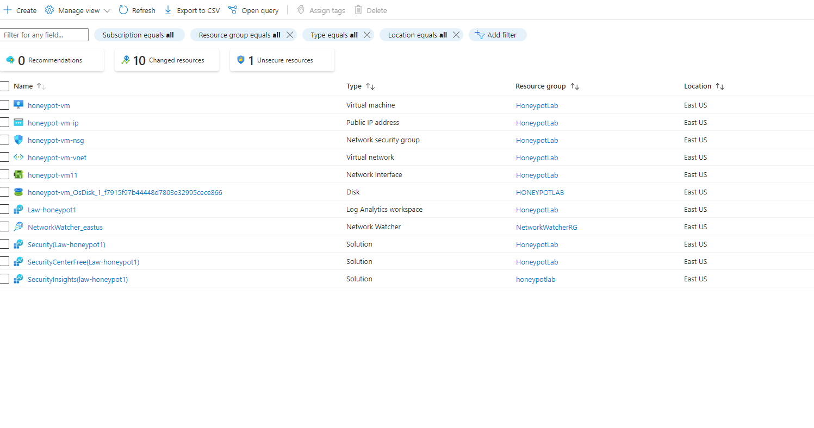
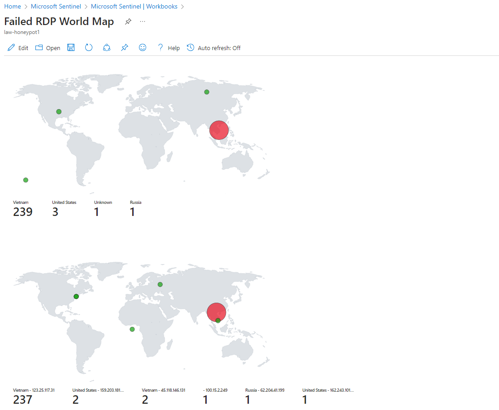

# SIEM-Lab-Azure-Sentinel

## Project Overview

This project demonstrates the setup and monitoring of a **SOC Honeypot lab in Azure**, leveraging **Microsoft Sentinel**, **Log Analytics**, and **Virtual Machines** to detect and analyze unauthorized Remote Desktop Protocol (RDP) attempts from around the world.

The goal of this lab is to simulate a vulnerable environment in a controlled setting to understand attacker behavior, visualize global attack sources, and explore SIEM capabilities for threat detection and incident response.

---

## Lab Objectives

- Deploy two virtual machines in Azure configured to simulate a honeypot
- Set up a Log Analytics workspace and link it with Microsoft Sentinel
- Enable diagnostic settings to forward logs from VMs to Sentinel
- Create custom detection rules and workbooks to track RDP brute-force attempts
- Visualize malicious login attempts on a world map using built-in analytics tools

---

## Tools & Technologies

- **Azure Virtual Machines** (Windows Server)
- **Microsoft Sentinel** (SIEM solution)
- **Log Analytics Workspace**
- **RDP Brute Force Workbook**
- **Threat Intelligence Map**

---

## Lab Setup Steps

> Based on [this tutorial video](https://youtu.be/g5JL2RIbThM?si=pJrclZgGGXbcFgkS), customized and executed in my own Azure tenant.

1. **Created Azure VMs**
   - Deployed two Windows Server VMs.
   - Left RDP ports open to the internet to simulate vulnerability.

2. **Configured Log Analytics**
   - Created a Log Analytics workspace.
   - Connected both VMs to the workspace for log ingestion.

3. **Enabled Microsoft Sentinel**
   - Enabled Microsoft Sentinel in the workspace.
   - Installed key analytic rules and content packs.

4. **Enabled Diagnostic Logging**
   - Configured diagnostic settings to send security and event logs to Log Analytics.

5. **Built RDP Brute Force Workbook**
   - Used Microsoft Sentinel templates to build and customize a workbook.
   - Visualized incoming failed RDP attempts in near real-time.

6. **Mapped Global Attack Sources**
   - Visualized brute-force attempts using a world map (screenshot below).
   - Highlighted common attacker IPs and geolocations.

---

## Screenshots

### VM Deployment

### Microsoft Sentinel Setup

### Threat Map - RDP Brute Force Attempts

---

## Key Takeaways

- **Leaving RDP exposed to the internet** results in **immediate attacks** from global IPs.
- Azure provides **powerful SIEM capabilities** through Sentinel for **real-time alerting and visualization**.
- Log Analytics and workbooks allow for **custom dashboards** that are great for threat hunting and executive reporting.
- This lab setup simulates real-world SOC monitoring scenarios in a **safe and controlled environment**.

---

## Contact & Portfolio

For more labs and blue-team projects:

- **GitHub:** (https://github.com/cybercay)
- **LinkedIn:** (www.linkedin.com/in/caycharles)

